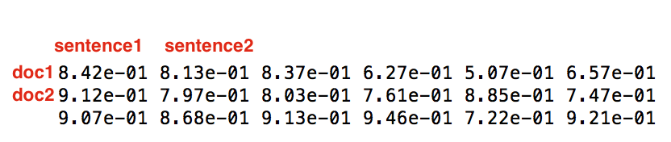

# NeuralSum

This folder contains the code for NeuralSum by Cheng and Lapata (2016). We modified the code
a bit to allow for printing the predicted summary.

Neural Network Summarizer

## Features(to be included)
* **Hierarchical encoder**
..* **CNN sentence encoder**
..* **LSTM document encoder**
..* **Bidirectional LSTM document encoder**
* **Sentence extraction**
..* **Extraction with LSTM decoder**
..* **Prediction on top of BiLSTM encoder**
* **Word generator**
..* **Vanilla decoder**
..* **Hierarchical attention decoder**
..* **Beam-search decoder**
..* **External language model**
* **Post-process**
..* **LR Ranker**
..* **MERT feature-tuning**
..* **RL feature-tuning**

## Dependencies
* numpy
* scipy
* tensorflow
* scikit-learn

## Quick-start
* [Data](https://docs.google.com/uc?id=0B0Obe9L1qtsnSXZEd0JCenIyejg&export=download)
* Pretrian a general-purpose encoder: ```python pretrain.py```
* Training ```python train.py```
* Evaluate ```python evaluate.py```

## Visualize scores
Sentence scores are stored during evaluation.




## Citation
```
@InProceedings{cheng-lapata:2016:P16-1, 
  author = {Cheng, Jianpeng and Lapata, Mirella}, 
  title = {Neural Summarization by Extracting Sentences and Words}, 
  booktitle = {Proceedings of the 54th Annual Meeting of the Association for Computational Linguistics (Volume 1: Long Papers)}, 
  year = {2016}, 
  address = {Berlin, Germany}, 
  publisher = {Association for Computational Linguistics}, 
  pages = {484--494} 
 }
```
## Reference
* [char-CNN-LSTM](https://github.com/carpedm20/lstm-char-cnn-tensorflow)
* [seq2seq](https://github.com/tensorflow/models/blob/master/textsum/seq2seq_attention_model.py)

## Liscense
MIT
